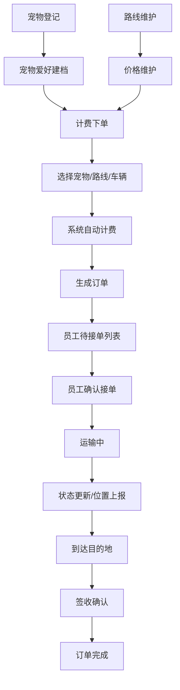

## 1. 产品概述
宠物托运系统是一套面向宠物运输服务的全流程管理平台，覆盖宠物信息登记、爱好建档、路线规划、价格维护、车辆调度、订单计费、员工接单、运输跟踪及到达签收等核心业务环节。
- 目标用户：宠物主人（客户）、系统管理员、运输员工
- 产品价值：规范化宠物托运流程，保障宠物运输安全，提升服务效率与用户体验

## 2. 核心功能

### 2.1 用户角色
| 角色 | 注册方式 | 核心权限 |
|------|----------|----------|
| 客户 | 手机号注册 | 宠物登记、下单、查看订单状态 |
| 管理员 | 后台创建 | 路线管理、价格维护、车辆管理、员工管理、订单管理 |
| 运输员工 | 管理员创建 | 查看待接单、接单、更新运输状态、确认到达 |

### 2.2 功能模块
1. **首页仪表板**：订单统计、运输状态概览、快捷入口
2. **宠物管理**：宠物登记、宠物爱好建档、宠物信息列表
3. **路线与价格**：运输路线维护、基础价格配置
4. **车辆管理**：车辆信息维护、车辆状态管理
5. **订单中心**：计费下单、订单列表、订单详情
6. **运输调度**：员工接单、运输跟踪、到达确认
7. **员工管理**：员工信息、接单状态

### 2.3 页面详情
| 页面名称 | 模块名称 | 功能描述 |
|----------|----------|----------|
| 首页仪表板 | 数据统计卡片 | 展示待处理订单、运输中订单、今日完成订单、宠物总数 |
| 首页仪表板 | 最近订单列表 | 展示最新5条订单，显示状态和操作按钮 |
| 宠物登记 | 宠物信息表单 | 录入宠物名称、品种、年龄、性别、体重、照片 |
| 宠物登记 | 宠物列表 | 搜索、筛选、查看、编辑、删除宠物 |
| 宠物爱好建档 | 爱好表单 | 记录饮食习惯、作息规律、特殊需求、医疗信息 |
| 运输路线 | 路线列表 | 展示起点-终点、距离、预计时长、基础价格 |
| 运输路线 | 路线表单 | 新增/编辑路线信息 |
| 价格维护 | 价格配置 | 按车型、宠物类型、重量阶梯设置价格 |
| 车辆管理 | 车辆列表 | 车牌号、车型、容量、当前状态、司机信息 |
| 车辆管理 | 车辆表单 | 新增/编辑车辆信息 |
| 计费下单 | 下单表单 | 选择宠物、路线、车辆，自动计算费用 |
| 计费下单 | 费用明细 | 基础运费、附加费用、优惠、总价展示 |
| 订单中心 | 订单列表 | 全部订单筛选、搜索、状态标签 |
| 订单详情 | 运输流程 | 订单状态时间线、宠物信息、路线信息、费用明细 |
| 运输调度 | 待接单列表 | 员工可接订单展示、一键接单 |
| 运输调度 | 运输中 | 更新位置、状态备注、异常上报 |
| 到达确认 | 签收表单 | 到达时间、签收人、照片凭证、满意度评价 |
| 员工管理 | 员工列表 | 姓名、工号、联系方式、接单状态 |

## 3. 核心流程

### 主业务流程
客户登记宠物信息并完善爱好档案 → 管理员维护运输路线和基础价格 → 客户选择路线、宠物和车辆下单 → 系统自动计算费用并生成订单 → 员工查看待接单并确认接单 → 员工执行运输并实时更新状态 → 到达目的地后确认签收 → 订单完成归档。

## 4. 用户界面设计

### 4.1 设计风格
- **主色调**：温暖橙 #FF8C42（宠物友好、活力）
- **辅助色**：深青蓝 #2D6A4F（专业、可信赖）
- **点缀色**：米黄 #FFE8D6（温暖背景）、嫩绿 #95D5B2（成功状态）
- **按钮风格**：圆角 12px，微阴影，悬停微放大动效
- **字体**：标题用「思源黑体 Bold」，正文用「思源黑体 Regular」，数字用等宽字体
- **布局风格**：左侧导航 + 右侧内容区，卡片式布局，圆角柔和，大量留白
- **图标风格**：可爱线性图标 + emoji 点缀，体现宠物主题

### 4.2 页面设计概述
| 页面名称 | 模块名称 | UI 元素 |
|----------|----------|----------|
| 首页仪表板 | 统计卡片 | 渐变背景卡片，数字动画，图标悬浮动效 |
| 宠物登记 | 表单卡片 | 分步表单，照片上传预览，温暖色调输入框 |
| 订单详情 | 状态时间线 | 垂直时间线，状态节点带动画，当前状态高亮 |
| 计费下单 | 费用明细 | 分层价格展示，计算动效，确认按钮脉冲动画 |
| 运输调度 | 运输地图 | 路线示意，车辆位置标记，状态进度条 |

### 4.3 响应式
桌面端优先（1280px+），适配平板（768-1279px）隐藏次要导航列，移动端（<768px）底部Tab导航，卡片垂直堆叠。
