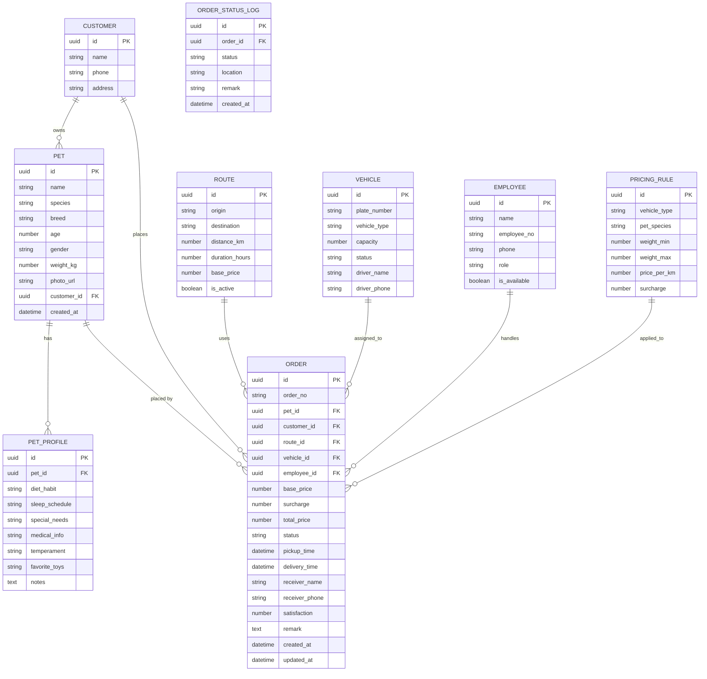

## 1. 架构设计


## 2. 技术描述
- **前端框架**：React@18 + TypeScript
- **构建工具**：Vite@5
- **样式方案**：TailwindCSS@3 + CSS 变量
- **路由管理**：React Router@6
- **状态管理**：Zustand（轻量、简洁）
- **图标库**：Lucide React
- **数据存储**：localStorage 持久化 + Mock 数据
- **动画库**：Framer Motion

## 3. 路由定义
| 路由 | 用途 |
|------|------|
| / | 首页仪表板 |
| /pets | 宠物列表 |
| /pets/new | 新增宠物登记 |
| /pets/:id | 宠物详情/爱好建档 |
| /pets/:id/profile | 宠物爱好建档编辑 |
| /routes | 运输路线管理 |
| /routes/new | 新增运输路线 |
| /pricing | 基础价格维护 |
| /vehicles | 车辆管理 |
| /vehicles/new | 新增车辆 |
| /orders | 订单列表 |
| /orders/new | 计费下单 |
| /orders/:id | 订单详情/运输流程 |
| /dispatch | 运输调度（员工接单） |
| /employees | 员工管理 |

## 4. 数据模型

### 4.1 实体关系图



### 4.2 订单状态枚举
- `pending`：待接单
- `accepted`：已接单
- `picked_up`：已接宠
- `in_transit`：运输中
- `arrived`：已到达
- `completed`：已完成
- `cancelled`：已取消

## 5. 项目目录结构
```
src/
├── components/          # 通用组件
│   ├── Layout/          # 布局组件（侧边栏、头部）
│   ├── ui/              # 基础UI组件（按钮、卡片、表单等）
│   └── StatusTimeline/  # 状态时间线组件
├── pages/               # 页面组件
│   ├── Dashboard/
│   ├── Pets/
│   ├── Routes/
│   ├── Pricing/
│   ├── Vehicles/
│   ├── Orders/
│   ├── Dispatch/
│   └── Employees/
├── store/               # Zustand 状态管理
│   ├── petStore.ts
│   ├── orderStore.ts
│   ├── routeStore.ts
│   ├── vehicleStore.ts
│   └── employeeStore.ts
├── types/               # TypeScript 类型定义
├── utils/               # 工具函数（计费计算、格式化等）
├── mock/                # Mock 初始数据
├── assets/              # 静态资源
├── App.tsx
├── main.tsx
└── index.css
```
